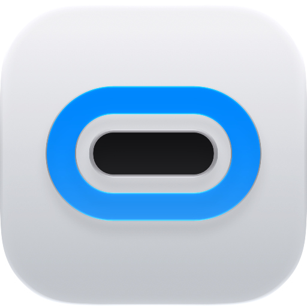
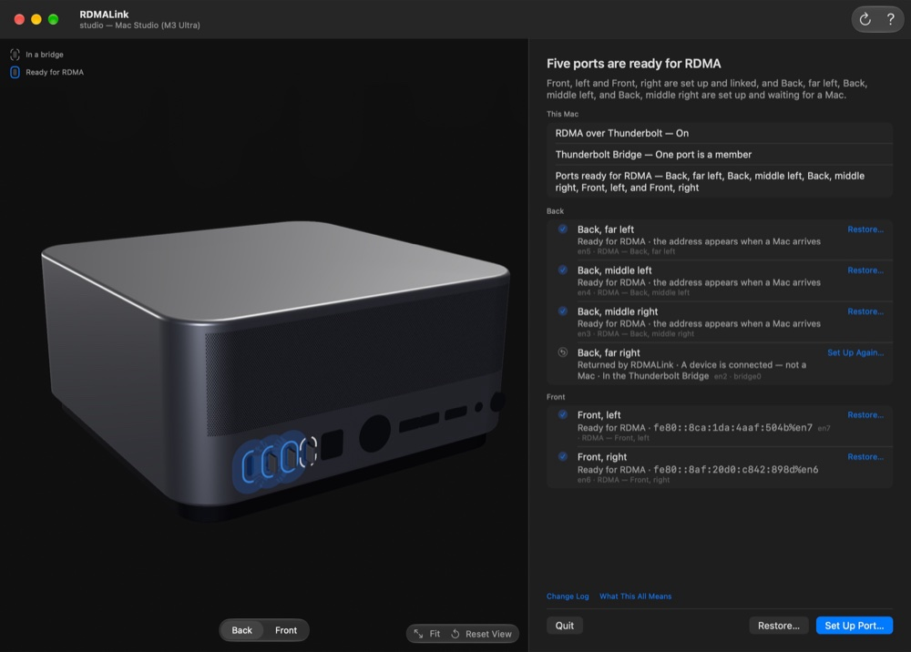

<p align="center">
  
</p>

<h1 align="center">RDMALink</h1>

<p align="center">
  <b>Cable your Macs together without a loop.</b><br>
  A small utility for Macs with Thunderbolt 5.
</p>

<p align="center">
  <a href="https://dev7a.github.io/rdmalink/">Website</a> ·
  <a href="https://github.com/dev7a/rdmalink/releases/latest">Download</a> ·
  <a href="#install">Install</a> ·
  <a href="docs/ARCHITECTURE.md">Architecture</a>
</p>

<p align="center">
  <picture>
    <source media="(prefers-color-scheme: light)" srcset="site/src/assets/shots/1000/hub-light.jpg">
    
  </picture>
</p>

With RDMALink you choose which Thunderbolt ports stay in Thunderbolt Bridge and
which leave it. A port that leaves gets an IPv6 link-local address of its own,
and you can cable it to another Mac for RDMA without creating a network loop.
RDMALink changes only the Mac it runs on, and it can put every port it touched
back the way it found it.

## Why

macOS puts all your Thunderbolt ports in one bridge, and the bridge passes
traffic from each port on to the others. Join two Macs with two cables, or
three Macs in a ring, and the same traffic can keep going round, using up
processor time and slowing the network down.

Apple's technote [TN3205](https://developer.apple.com/documentation/technotes/tn3205-low-latency-communication-with-rdma-over-thunderbolt)
says to turn Thunderbolt Bridge off for Macs connected in a loop. RDMALink lets
you choose instead: the ports you cable to other Macs leave the bridge, and the
rest stay in it.

## How it works

Three steps for each cable:

1. **Choose.** Click the port on the 3D picture of your Mac, or pick it from
   the list. Identify Port… finds the one your cable is in.
2. **Review.** Every change, with its before and after. Set Up Port asks for an
   administrator's password once.
3. **Ready.** Once another Mac is connected, the port has its own link-local
   address. Copy it, then set up the other end.

RDMALink only changes the Mac it runs on, so each end of a cable is set up on
its own Mac. **What to Do on the Other Mac** lists the steps for the Mac at the
other end.

Add cables one at a time. While two Macs' ports are still in Thunderbolt
Bridge, a second cable between them makes a loop. Once both ends of a cable are
set up, those two ports are out of the bridge and the next cable can go in.
RDMALink won't set up a port while two ports with a Mac on the end share a
bridge, and carries on once one of those cables is out.

## Macs

| Mac | Chips | Thunderbolt 5 ports |
| --- | --- | --- |
| Mac Studio | M3 Ultra, M4 Max, M5 Max, M5 Ultra | Four on the back, plus two on the front on Ultra models |
| Mac mini | M4 Pro, M5 Pro | Three, all on the back. The two on the front are USB-C. |
| MacBook Pro 14-inch and 16-inch | M4 Pro, M4 Max, M5 Pro, M5 Max | Two on the left, one on the right |

RDMALink sets up only a Mac it knows has Thunderbolt 5. On any other Mac (one
it can't recognize, one with Thunderbolt 4, or one newer than this version of
RDMALink) it opens read-only: you can look at everything, and it sets nothing
up.

## What it changes, and what that means for you

RDMALink is a network-configuration tool. Before you run it, know this much:

- **It changes your network settings.** It removes a Thunderbolt port from
  every bridge it is in and creates a network service for that port with IPv4
  off and IPv6 link-local only. It never creates or deletes a bridge, and it
  never touches a port you did not pick.
- **It uses a private macOS interface.** Bridge membership has no public API,
  so RDMALink resolves the undocumented `SCBridgeInterface*` symbols with
  `dlsym` before it uses them. If one is missing on your system, the change
  stops and is rolled back, and the app explains the manual route through
  System Settings instead of guessing.
- **It asks for an administrator password, once per change.** That is macOS's
  own prompt for the right to change network settings
  (`system.services.systemconfiguration.network`). RDMALink holds that right
  for one burst of writes and then drops it. Putting a port back asks again.
- **It keeps undo notes on your disk**, one small JSON file per port, in
  `~/Library/Application Support/RDMALink`. Those notes are what makes
  "put it back" possible. They are safe to back up and safe to leave alone.
- **It is not sandboxed.** Neither the Authorization API nor the bridge SPI is
  available to a sandboxed app, so RDMALink ships outside the App Store as a
  notarized download.
- **It talks to nothing.** There is no network request, no telemetry, no update
  check and no background agent. It is a tool you open, not a thing that lives
  on your Mac.

## Requirements

- Apple silicon, macOS 27, and Thunderbolt 5 (see [Macs](#macs)).
- **RDMA over Thunderbolt switched on**, in System Settings › Privacy &
  Security › Developer Tools, followed by a restart. This is not RDMALink's to
  flip: the switch lives in NVRAM and only System Settings sets it. The app
  detects it, deep-links you to the right pane, and notices the moment it is on
  (see [docs/ARCHITECTURE.md](docs/ARCHITECTURE.md) under Decisions, "RDMA
  switch").
- A second Mac at the other end of each Thunderbolt cable, set up the same way.

## Install

With Homebrew, from the [dev7a tap](https://github.com/dev7a/homebrew-tap):

```sh
brew install --cask dev7a/tap/rdmalink
```

Or download `RDMALink-<version>.dmg` from the
[releases page](https://github.com/dev7a/rdmalink/releases), open it and drag
RDMALink to Applications. The app is signed with a Developer ID and notarized,
so macOS opens it without any override.

The cask downloads the same release image, checks its pinned SHA-256 and puts
RDMALink in Applications. `brew upgrade --cask dev7a/tap/rdmalink` follows new
releases; uninstalling the cask removes the app and keeps the undo notes.

### Checking what you downloaded

Every release carries `SHA256SUMS` and `release.json` beside the image. Put the
image next to `SHA256SUMS` and run both of these:

```sh
shasum -a 256 -c SHA256SUMS
spctl --assess --type open --context context:primary-signature -vv RDMALink-<version>.dmg
```

The first must print `OK`. The second must print `source=Notarized Developer ID`;
anything else means the image is not the one Apple notarized. There is more on
this in [script/release/README.md](script/release/README.md).

`release.json` is the build's receipt: the tag, the commit and the tag object
the image was built from, the version and build number, the architecture and
minimum macOS, the team and bundle identifier, Apple's notarization result for
both the app and the image, and the Xcode version that built it.

## Reporting problems

Bugs, port layouts RDMALink does not recognize, and anything it got wrong about
your Mac: [GitHub Issues](https://github.com/dev7a/rdmalink/issues). The app's
Help menu has **Save Diagnostics File…**, which writes a plain text file with
what RDMALink can see on this Mac and what it changed. That file is the single
most useful thing to attach.

For a security vulnerability, do not open an issue. See
[SECURITY.md](SECURITY.md).

## Build from source

Xcode 27 on macOS 27. The gate is:

```sh
script/test.sh
```

It builds and tests the Core package and the command-line tool, runs the
presentation and stage-math suites and the three release-script tests, and
builds the app Debug with an ad-hoc signature, so it needs no signing identity
and no network.

`script/package_dmg.sh` builds the signed, notarized disk image. It is
maintainer-only: it requires the project's Developer ID Application identity in
your Keychain, and a release is cut by pushing a signed `v<version>` tag, which
builds and notarizes on GitHub. See
[script/release/README.md](script/release/README.md).

There is also `rdmalink`, a read-only command-line companion built by the Core
package: `inventory`, `status`, `refusals`, `changes`, and a preview of what
each operation would do. It never writes anything.

## Documentation

- Every string in the app, screen by screen, and the reasoning behind them:
  [docs/UX_SPEC.md](docs/UX_SPEC.md)
- Module layout, the verified macOS constraints behind each decision, packaging
  and the release pipeline: [docs/ARCHITECTURE.md](docs/ARCHITECTURE.md)
- The website, its build and where each asset comes from:
  [site/README.md](site/README.md)

## License

MIT. See [LICENSE](LICENSE).
